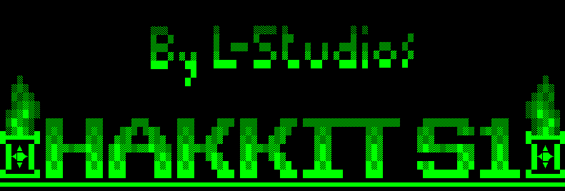
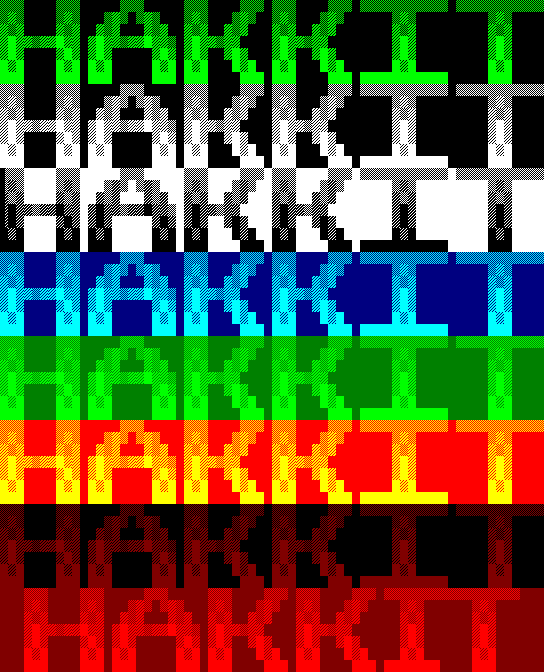
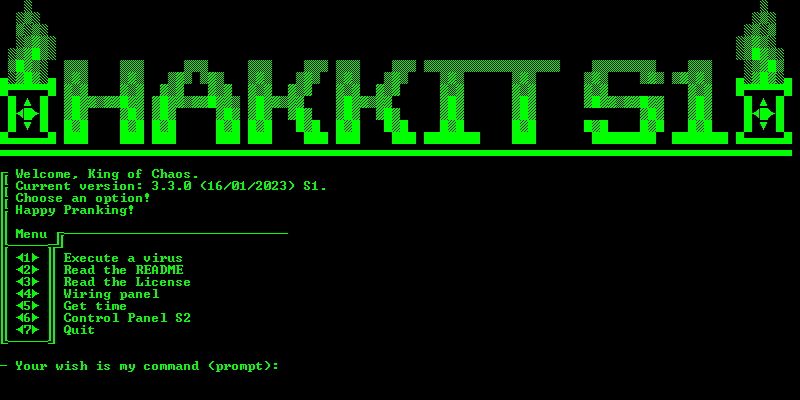

## Fake Virus Pack for Windows:
`Package version: 3.3.0 (17/06/2023)`

**WARNING: READ THIS README OR YOU WILL MOST PROBABLY ACTIVATE A TON OF TRAPS**

**Intro**: This is a fake virus pack I built a long time ago; I have looked it over, but it may not work as described (especially in Windows 10/11). The password is "`H4CK3R`", and the quick password is "`7`", then "`5`". Find the easter egg lol

### Capabilities
This pack contains several fake viruses written mostly in `Batch`, `VBScript`, `HTML`, and `JS` for Windows, none of which are harmful to the computer. However they can lose you unsaved data. It is capable of:
- crashing your computer
- shutting down your computer
- freezing your computer
- blocking your computer
- making your operating system and hardware behave in irregular ways
- taking over your screen
- taking over your keyboard
- giving heart attacks
- or even doing useful stuff

ALL of these fake viruses can be killed by shutting down your computer (some even do it for you) and do not restart when the computer is turned on.
To launch, double-click on the "Control Panel" file. Do not delete, move or modify any of the files contained in the hakkit_files folder, otherwise it could no longer work, or do so fragmentally (devs, ignore this). The control center closes itself after executing most viruses, so the script can't be traced _that_ easily.
When I say "your computer", I mean the computer the script is run on.

### Themes
There are eight themes:
1. Dark Hacker Mode
2. Dark >_ CMD Mode
3. An Innocent Mode
4. Deep Waters Mode
5. Lush Forest Mode
6. Crazy Clown Mode
7. Megalomania Mode
8. Blood Craze Mode

### Setup
No installation is required; just download the ZIP, decompress, and open the Control Panel.ink shortcut. To change the passwords, edit the `HAKKIT_FILES\pcalc.bat` file.
Create a shortcut to the Control Panel anywhere, and you can use the `HAKKIT_FILES\icon.ico` icon for a better look. When you open the Control Panel, it should open a cmd window that looks like this:

### General
**Be warned**: The `Control Panel S2` is a deathtrap; it's for intruders who don't know the password, who will be definitely falling into this one.
- The `Get time` is a window which spits out the current time in a cool way.
- The `Wiring Panel` aka settings is where you change the theme and read some instructions; It's apparently a years-old WIP that doues nothing else unfortunately.
- The other menu items are pretty self-explanatory.
Use this weapon wisely.
Don't make your little bro cry (too much)

### License

Distributed under a Creative Commons license (Attribution 3.0 Unported).
This program is free software; you can redistribute it and/or 
modify under the terms of the GNU General Public License as
 published by the Free Software Foundation; either version 3 of the 
license, or (at your option) any later version. 
This program is distributed in the hope that it will be useful, 
but WITHOUT ANY WARRANTY; without even the tacit guarantee of 
MERCHANTABILITY or FITNESS FOR A PARTICULAR PURPOSE. 
See the GNU General Public License for more details (see http://www.gnu.org/licenses).

`The author (L-Studios) assumes no responsibility for illegal or abusing use of this pack (not that it's really possible).`
